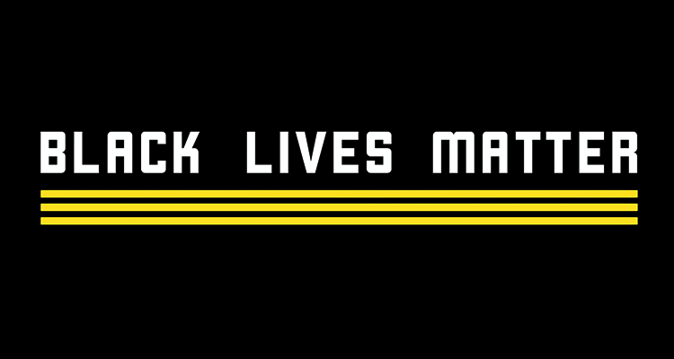
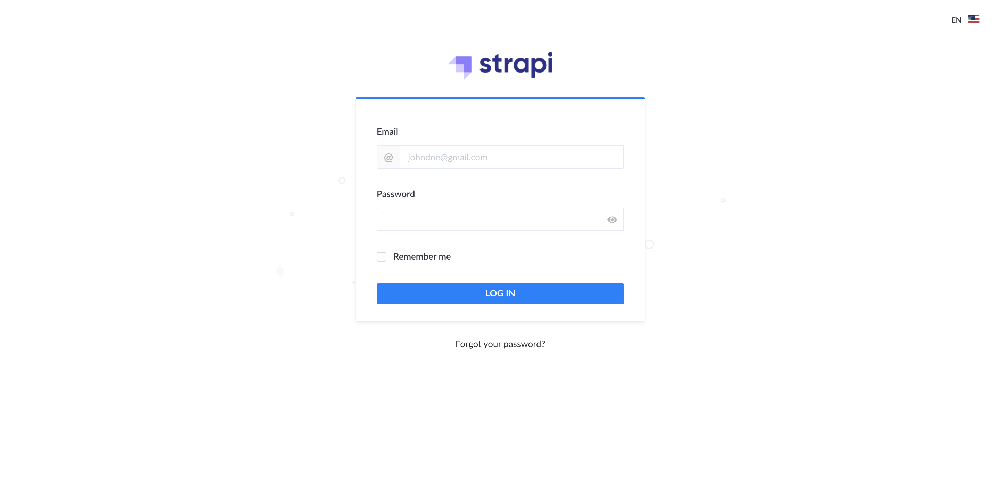
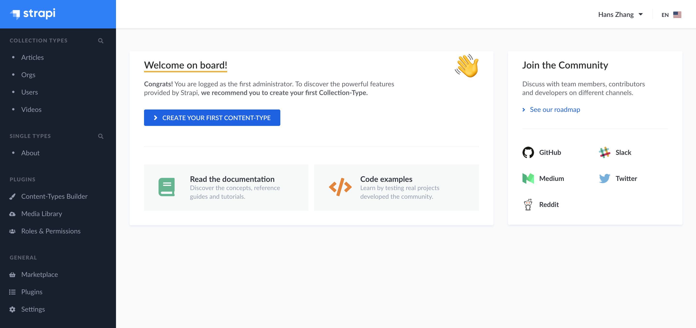

# BLM-information-site

 

  

<!-- short description -->

  BLM Information Site Backend ♥️</a>

  <strong>
    Live <a href="www.blmresources.online"> here</a>
      ✊🏿 
  </strong>

## Use

This is the backend of [**BLM-information's website**](https://github.com/hanszhang00/blm-resources).

**It can be utilized in three ways:**
- for developers who want to improve on the backend through a local copy
- for anyone to add more content and resources to the website directly
- for developers to query BLM-related data with RESTful endpoints

## Tech Stack

The backend is a Strapi server out of the box, with content data added throught the Strapi dashboard.

Strapi is a Node.js based headless CMS. Strapi is super easy to use and it has a super awesome UI. Please check out its website [**here**](https://strapi.io/)!

**Google Cloud PostGresSQL service** is used to store all of the data for the production encironment. All of the production-ready data is managed in the database. The local server uses a seperate database (SQLite) and thus is not synced with the production database due to security concerns. 

**Google Cloud** is also used for project's deployment.

## Contributing content

If you are interested in contributing more content, you need to have an admin account to get access to the Strapi console. Contact me [**here**](mailto:hanszhang2000@gmail.com) and I'm happy to send you the email and password.

Currently we have three types of resourceces, BLM-related organizations, videos, and articles.

- Firstly, go to the Strapi admin page at **http://www.blmresources.online/admin**

- Log in with the given email and passowrd, it will take you to the main console

- Now, you can update the content of any content type. **Please do not** delete any existing resources and only add new ones.

